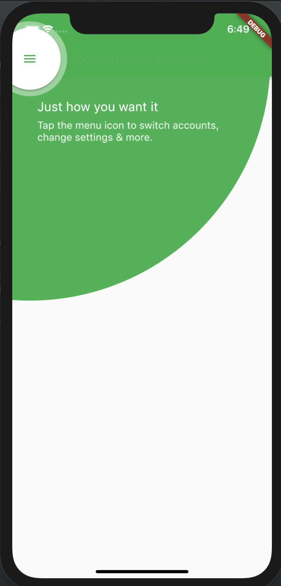

# FeatureDiscovery

A feature discovery prompt focuses user attention on a specific UI element. It contains a tap target, indicated by a circular shape, which is surrounded by a larger area with a distinct background color.

Here is the material specifications for this widget. https://material.io/archive/guidelines/growth-communications/feature-discovery.html#feature-discovery-design

## Usage

Wrap the widget you want to be showcased in a FeatureDiscovery widget and put a
FeatureDiscoveryController widget above any FeatureDiscovery widgets as an
ancestor.

There should only be one FeatureDiscoveryController widget in the widget tree.

```dart
Scaffold(
      appBar: AppBar(
        backgroundColor: Colors.green,
        title: Text('Feature Discovery'),
        leading: FeatureDiscoveryController(
          FeatureDiscovery(
            color: Theme.of(context).primaryColor,
            description: 'description',
            showOverlay: showOverlay,
            title: 'Title',
            onDismiss: () {
              setState(() {
                showOverlay = false;
              });
            },
            onTap: () {
              setState(() {
                showOverlay = false;
              });
            },
            child: Icon(Icons.menu),
          ),
        ),
      ),
      body: Center(
          child: GestureDetector(
              onTap: () {
                setState(() {
                  showOverlay = true;
                });
              },
              child: Text('Explore feature discovery!'),
          ),
      ),
    );
```

Would result in this screenshot:




## User actions

>Tap

User can tap on the child to perform a tap action. The overlay will expand briefly before closing.

>Dismiss

User can tap outside the background of the overlay to perform a dismiss action. The overlay will shrink until it disappears.
